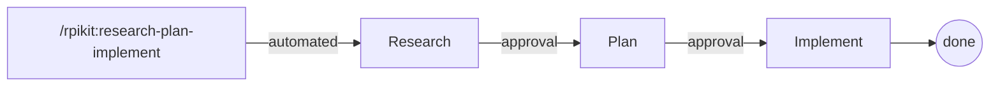
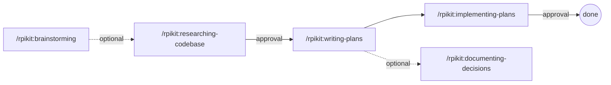

# rpikit

A plugin implementing the **Research-Plan-Implement (RPI)** framework for
disciplined software engineering.

## Philosophy

> Understand before acting. Plan before coding. Implement with discipline.

This plugin enforces a structured workflow that prevents premature
implementation and ensures human oversight at critical decision points.

## Installation

### Step 1: Add the marketplace

```bash
/plugin marketplace add bostonaholic/rpikit
```

### Step 2: Install the plugin

```bash
/plugin install rpikit
```

## Quick Start

| Slash Command                       | Purpose                                        |
| ----------------------------------- | ---------------------------------------------- |
| `/rpikit:research-plan-implement`   | End-to-end research, plan, and implement pipeline |
| `/rpikit:brainstorming`             | Explore ideas when requirements are unclear    |
| `/rpikit:researching-codebase`      | Understand the codebase and gather context     |
| `/rpikit:writing-plans`             | Create an actionable implementation plan       |
| `/rpikit:implementing-plans`        | Execute the plan with discipline               |
| `/rpikit:reviewing-code`            | Review changes for quality and maintainability |
| `/rpikit:security-review`           | Review changes for security vulnerabilities    |
| `/rpikit:documenting-decisions`     | Record architectural decisions as ADRs         |

## Workflow

### Full Pipeline



The `/rpikit:research-plan-implement` skill runs the full pipeline in a single
session using parallel subagents, with approval gates between phases.

### Individual Skills



For more control, run each phase as a separate skill. Each phase produces
artifacts in `docs/plans/` and requires human approval before transitioning
to the next phase.

### Brainstorming vs. Research

Both commands start by asking clarifying questions before acting. The key
difference is their purpose:

| Brainstorming | Research |
|---------------|----------|
| *What* should we build? | *How* does it work? |
| Explores design approaches | Explores existing code |
| Vague idea → clear design | Clear topic → codebase understanding |

**Use Brainstorming when:**

- Requirements are vague: "Add user auth" → What kind? OAuth? JWT? Sessions?
- Multiple approaches exist: "Improve performance" → Which areas? What trade-offs?
- Design decisions needed before you can research

**Use Research when:**

- You know what to build but need to understand the codebase
- "Where is authentication implemented?" → Finds files, traces flow
- "How does the existing caching work?" → Documents patterns

**Common flow:** Brainstorm first (if unclear) → Research → Plan → Implement

## Output Structure

```text
docs/plans/
├── YYYY-MM-DD-<topic>-research.md   # Research findings with file:line references
└── YYYY-MM-DD-<topic>-plan.md       # Implementation plan with tasks and criteria

docs/decisions/
└── NNNN-decision-title.md           # Architecture Decision Records
```

## Usage Examples

### Full Pipeline (Recommended)

Run the entire research-plan-implement workflow in a single session:

```bash
/rpikit:research-plan-implement Add OAuth login with Google and GitHub providers
```

This spawns parallel research subagents, synthesizes findings, creates a plan,
and implements it — with approval gates between each phase.

### Step-by-Step Workflow

For more control, run each phase separately:

```bash
/rpikit:researching-codebase I want to add OAuth login - what auth patterns exist?
```

Review the research output in `docs/plans/`, then create a plan from it:

```bash
/rpikit:writing-plans @docs/plans/2025-01-07-oauth-login-research.md
```

Review and approve the plan, then implement from it:

```bash
/rpikit:implementing-plans @docs/plans/2025-01-07-oauth-login-plan.md
```

### Ad-hoc Code Review

Review current changes for quality issues:

```bash
/rpikit:reviewing-code
```

Review for security vulnerabilities:

```bash
/rpikit:security-review
```

### Recording Decisions

After planning or design work, record the decision as an ADR:

```bash
/rpikit:documenting-decisions @docs/plans/2025-01-07-oauth-login-design.md
```

### Stakes-Based Planning

The framework adapts to change complexity:

- **Low stakes** (docs, formatting): Minimal planning, quick execution
- **Medium stakes** (new features, refactors): Full RPI workflow
- **High stakes** (architecture, security): Thorough research and detailed planning

## Skills

The plugin includes methodology skills that guide disciplined development:

### Core RPI Workflow

- **research-plan-implement** - End-to-end pipeline orchestrating all RPI phases with parallel subagents
- **researching-codebase** - Thorough codebase research through interrogation
- **synthesizing-research** - Consolidate parallel research findings into a unified report
- **writing-plans** - Granular, verifiable implementation plans
- **implementing-plans** - Disciplined execution with checkpoint verification
- **reviewing-code** - Quality review using Conventional Comments
- **security-review** - Security-focused review for vulnerabilities

### Development Discipline

- **test-driven-development** - RED-GREEN-REFACTOR cycle enforcement
- **systematic-debugging** - Root cause investigation before fixes
- **verification-before-completion** - Evidence before claims
- **markdown-validation** - Validate markdown files with markdownlint

### Workflow Support

- **brainstorming** - Collaborative design before research/planning
- **documenting-decisions** - Record architectural decisions as ADRs
- **finishing-work** - Structured completion (merge, PR, cleanup)
- **receiving-code-review** - Verification-first response to feedback

### Advanced Patterns

- **git-worktrees** - Isolated workspaces for parallel work
- **parallel-agents** - Concurrent dispatch for independent tasks

## Architecture

For a detailed overview of how skills, agents, and hooks connect, see
[Architecture](docs/architecture.md).

## Inspired By

- [No Vibes Allowed](https://www.youtube.com/watch?v=rmvDxxNubIg) - Dex
  Horthy's talk on context engineering and the RPI workflow for solving hard
  problems in complex codebases
- [superpowers](https://github.com/obra/superpowers) - Composable skills
- [BMAD Method](https://github.com/bmad-code-org/BMAD-METHOD) - Scale-adaptive
  planning
- [SuperClaude Framework](https://github.com/SuperClaude-Org/SuperClaude_Framework) - Behavioral modes and deep research
- [RPI Framework](https://github.com/acampb/claude-rpi-framework) - RPI
  structure
- [HumanLayer](https://github.com/humanlayer/humanlayer) - Human-in-the-loop
  approval patterns

## License

MIT
