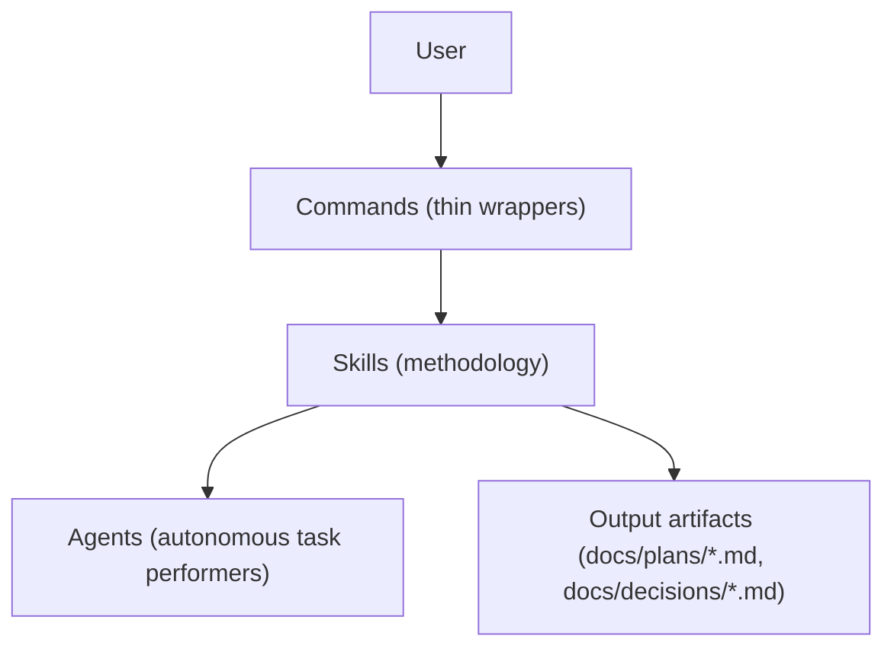
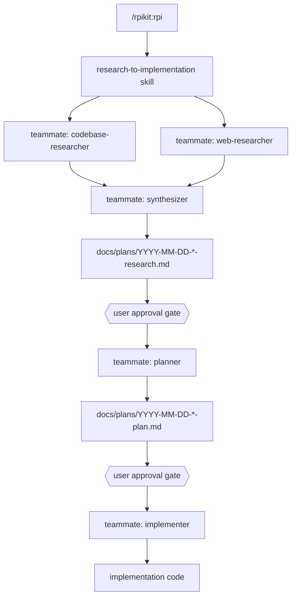
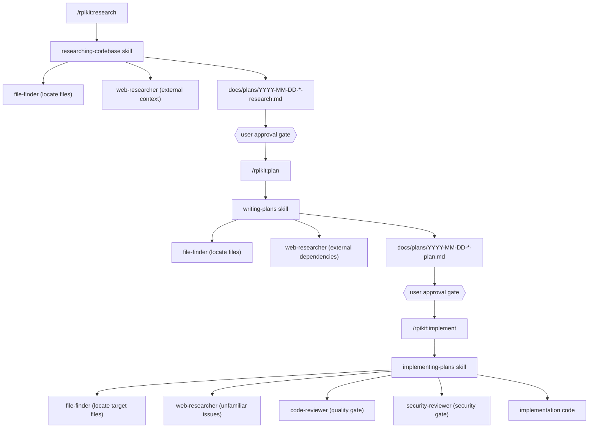
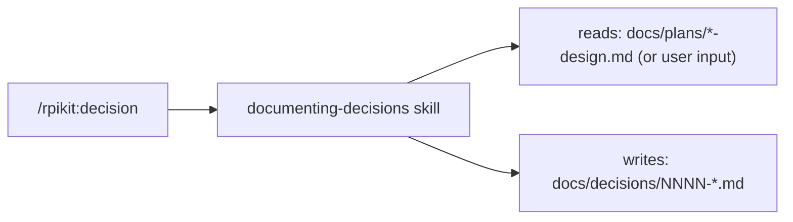
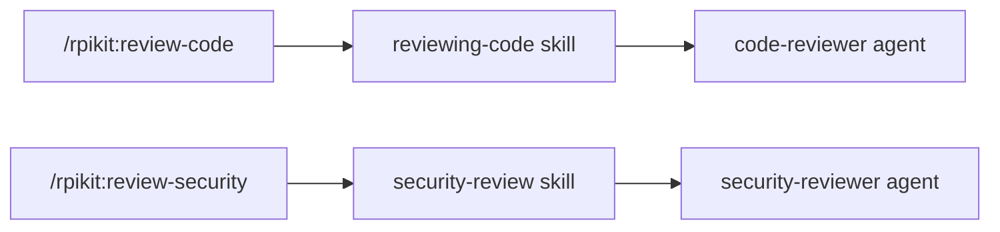

# Architecture

rpikit is a Claude Code plugin built on a layered component model. Commands
are user-facing entry points that delegate to skills. Skills contain
methodology instructions and orchestrate agents. Agents are autonomous task
performers. Hooks enforce quality automatically.

## Component Types

| Type     | Location            | Count | Role                         |
| -------- | ------------------- | ----- | ---------------------------- |
| Commands | `commands/*.md`     | 8     | User-facing entry points     |
| Skills   | `skills/*/SKILL.md` | 17    | Methodology instructions     |
| Agents   | `agents/*.md`       | 7     | Autonomous task performers   |
| Hooks    | `hooks/hooks.json`  | 1     | Automated quality enforcement|

## Commands

Commands are thin markdown wrappers with YAML frontmatter. Each immediately
delegates to a skill and does nothing else.

| Command                | Delegates To              | Purpose                            |
| ---------------------- | ------------------------- | ---------------------------------- |
| `/rpikit:rpi`          | research-to-implementation | End-to-end RPI pipeline            |
| `/rpikit:brainstorm`   | brainstorming             | Explore ideas before research      |
| `/rpikit:research`     | researching-codebase      | Deep codebase exploration          |
| `/rpikit:plan`         | writing-plans             | Create implementation plans        |
| `/rpikit:implement`    | implementing-plans        | Execute approved plans             |
| `/rpikit:review-code`  | reviewing-code            | Code quality and design review     |
| `/rpikit:review-security` | security-review        | Security vulnerability review      |
| `/rpikit:decision`     | documenting-decisions     | Record architectural decisions as ADRs |

## Skills

Skills are self-contained methodology documents that define how to perform
each activity and which agents to use.

### Core RPI Workflow

| Skill                       | Phase     | Agents Used                                               |
| --------------------------- | --------- | --------------------------------------------------------- |
| research-to-implementation  | All       | Orchestrates teammates for each phase                     |
| researching-codebase        | Research  | file-finder, web-researcher                               |
| synthesizing-research       | Research  | (none — reads and consolidates research files)            |
| writing-plans               | Plan      | file-finder, web-researcher                               |
| implementing-plans          | Implement | file-finder, web-researcher, code-reviewer, security-reviewer |

### Design and Review

| Skill           | Purpose                                |
| --------------- | -------------------------------------- |
| brainstorming           | Collaborative design exploration       |
| documenting-decisions   | Record decisions as ADRs               |
| reviewing-code          | Code review with Conventional Comments |
| security-review         | Security-focused vulnerability analysis|

### Development Discipline

| Skill                          | Purpose                              |
| ------------------------------ | ------------------------------------ |
| test-driven-development        | RED-GREEN-REFACTOR cycle enforcement |
| systematic-debugging           | Root cause investigation before fixes|
| verification-before-completion | Evidence-based completion claims     |

### Workflow Support

| Skill                 | Purpose                                  |
| --------------------- | ---------------------------------------- |
| finishing-work        | Structured completion (merge, PR, push)  |
| receiving-code-review | Verification-first response to feedback  |
| git-worktrees         | Isolated workspaces for parallel work    |
| parallel-agents       | Concurrent dispatch for independent tasks|
| markdown-validation   | Markdownlint enforcement with auto-fix   |

## Agents

Agents are specialized task performers invoked by skills via the Task tool.
Each has a model assignment and color for terminal display.

| Agent             | Model  | Color   | Purpose                               |
| ----------------- | ------ | ------- | ------------------------------------- |
| file-finder       | haiku  | cyan    | Locate relevant files in the codebase |
| web-researcher    | sonnet | magenta | Internet research with citations      |
| code-reviewer     | sonnet | blue    | Quality/design review (soft-gating)   |
| security-reviewer | sonnet | red     | Vulnerability analysis (hard-gating)  |
| test-runner       | haiku  | green   | Test execution and diagnostics        |
| debugger          | sonnet | orange  | Root cause investigation              |
| verifier          | haiku  | yellow  | Verification checks before completion |

Model selection follows a pattern: **haiku** for fast, mechanical tasks
(file search, test running, verification) and **sonnet** for tasks requiring
judgment (research, review, debugging).

## How Components Connect

### RPI Pipeline Flow

The `/rpikit:rpi` command orchestrates the full workflow in a single session
using agent teams. The team lead spawns teammates for each phase.

### Core RPI Flow (Individual Commands)

### Decision Flow

Decisions can be recorded after planning or design work:

### Review Flow

Reviews can be used at any point, independent of the RPI phases:

## Infrastructure

**Hooks**: `hooks/hooks.json` defines a PostToolUse hook that runs
`scripts/validate-markdown.sh` after every Write or Edit operation on
markdown files, enforcing formatting quality automatically.

**Linting**: `.markdownlint.json` defines the markdown linting rules used by
both the hook and the markdown-validation skill.

**CI**: `.github/workflows/ci.yml` provides automated validation on push and
pull requests.

## Design Principles

1. **Commands are always thin** - Frontmatter plus one line delegating to a
   skill. No methodology logic in commands.
2. **Skills own methodology** - All decision logic and instructions live in
   skills, not commands or agents.
3. **Agents are reusable** - file-finder and web-researcher are used across
   multiple skills rather than duplicated.
4. **Model selection by task type** - haiku for mechanical tasks, sonnet for
   judgment tasks.
5. **Output to docs/** - Research and plans written to `docs/plans/`,
   decisions written to `docs/decisions/` as numbered ADRs.
6. **Human approval gates** - Users review output between each RPI phase
   before the next phase begins.
